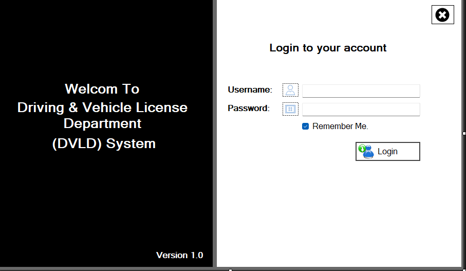
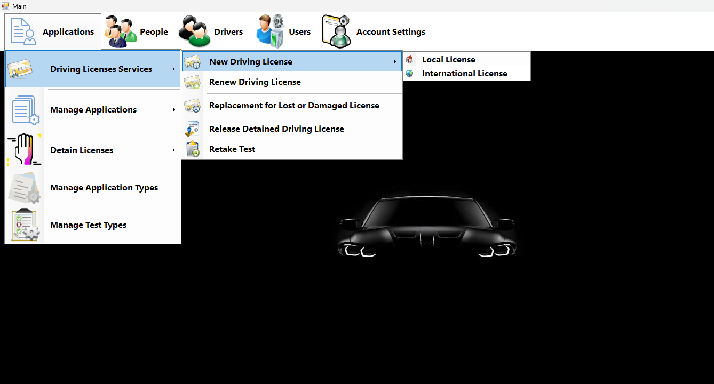
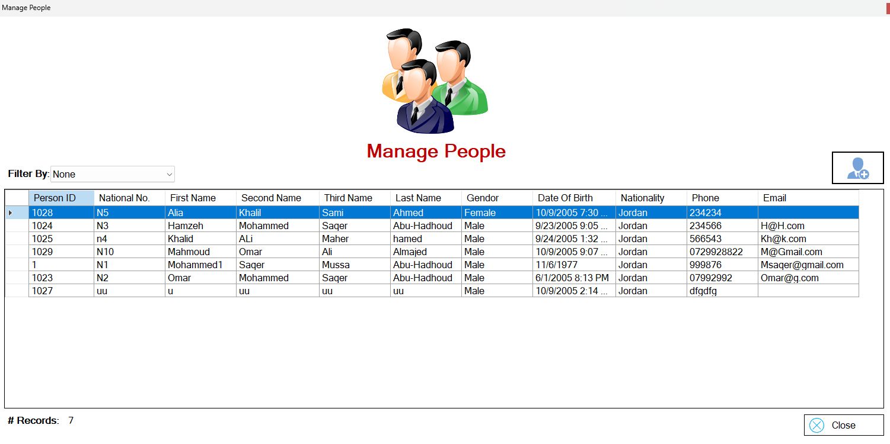
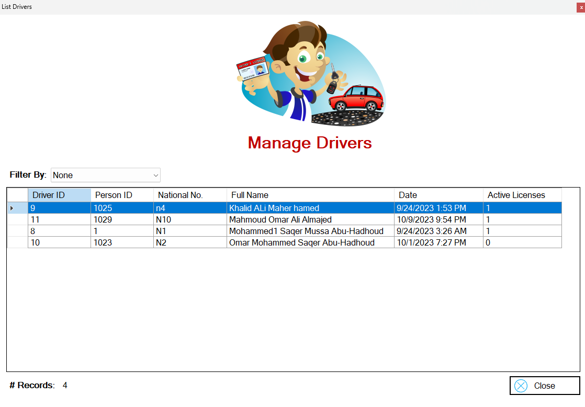
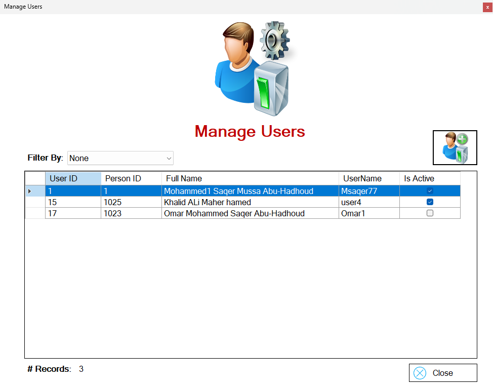

# 🏛️ DVLD Management System

Administrative desktop application built using **C#**, **SQL Server**, and clean architecture principles.

## 🔹 Features
- User authentication & authorization
- Client and user management
- Structured business logic
- Clean 3-Tier Architecture
- SOLID Principles applied

## 🛠️ Technologies
- C#
- SQL Server
- Object-Oriented Programming (OOP)
- SOLID Principles
- 3-Tier Architecture

## 📂 Architecture
- **DVLD** – Presentation Layer  
- **DVLD_Business** – Business Logic  
- **DVLD_DataAccess** – Data Access Layer  

## 📸 Screenshots
### 🔐 Login

### 🏠 Main Menu

### 👤 People Management

### 🚗 Drivers Management

### 👨‍💼 Users Management

### 🗄️ Database Design

## 👤 Author
**Anouar Derja**  
Junior Full-Stack Developer  
GitHub: https://github.com/Anouar-Derja
